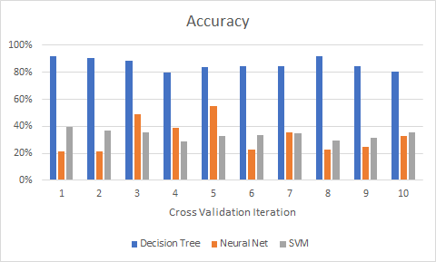

# Packet Sniffer
The goal of this project is to sniff local network traffic using the Scapy python library and then use Machine Learning on the collected flows to predict what type of network traffic the user is currently preforming: either common web browsing, video streaming, video chatting, or data downloading. The following steps were preformed to train the model:

1. Edit the `LABEL` variable in the data scraper script for the proper classification type (1 = browsing, 2 = streaming, 3 = chatting, 4 = downloading)
1. Close all currently running applications and processes to prevent inaccurate data
1. Start the script to begin collecting packets
1. Preform the specified task (browse Reddit, watch some Game of Thrones, Skype a friend, etc.)
1. After collecting the correct number of packets as specified by  `LOG_COUNT`, the script groups the packets into *flows*–packets the have the same source and destination
1. Flow features are then extracted and their correlating labels are then logged to `data.csv`
1. After collecting sufficient data for each browsing type, the Machine Learning script can successfully train its models

The features that were observed from the collected flows were:

1. Packet count
1. Total byte count
1. Average packet byte count
1. Protocol (TCP or UDP)
1. Sent or received
1. IP Flags
1. TCP Flags (if applicable)
1. Source port
1. Destination port

Three separate Machine Learning classifier algorithms were tested: Decision Tree, Neural Network, and Supporting Vector Machine. The models are created and scored ten times for cross validation. It was found that the Decision Tree classifier is by far the most accurate algorithm at around 90% accuracy. The other two algorithms score below 50%. The reason the Decision Tree classifier is the best is likely due to the fact that this data is much more conditionally correlated as opposed to mathematically correlated.

  

